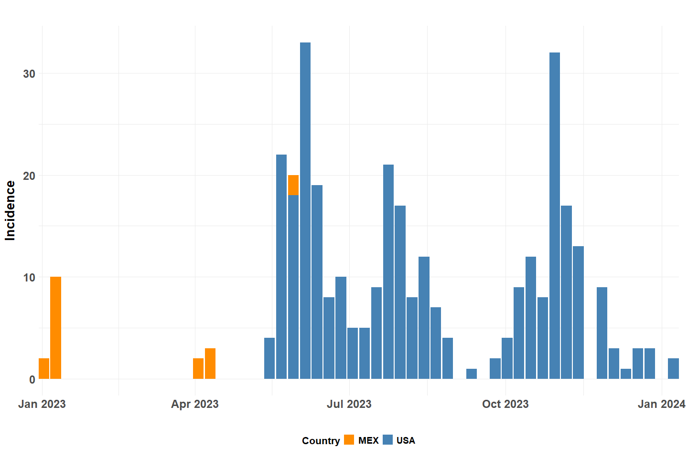
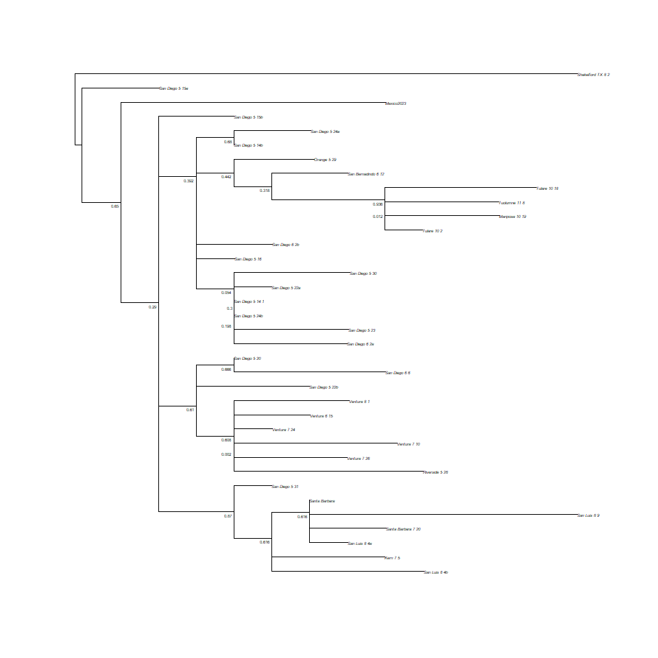
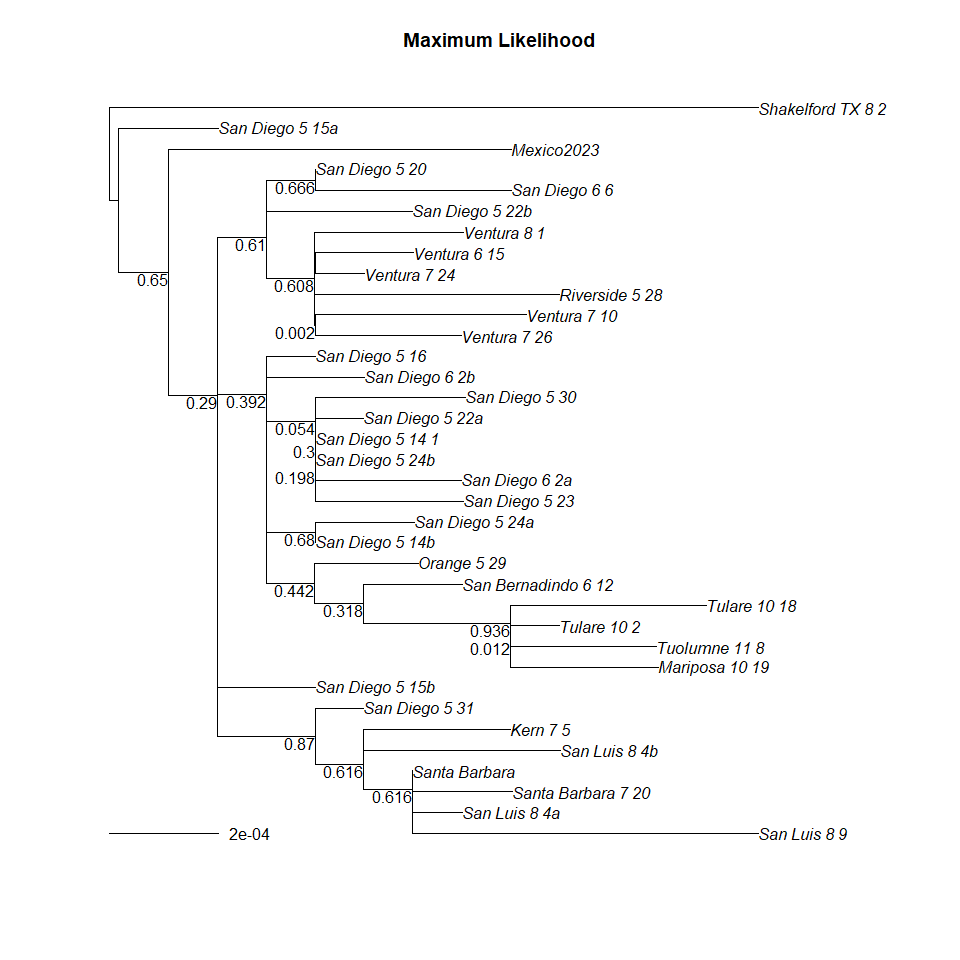
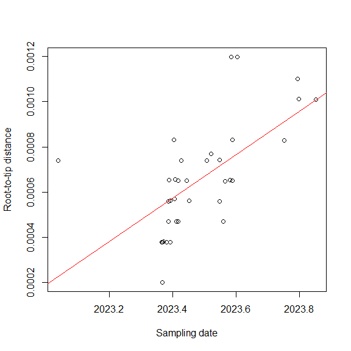
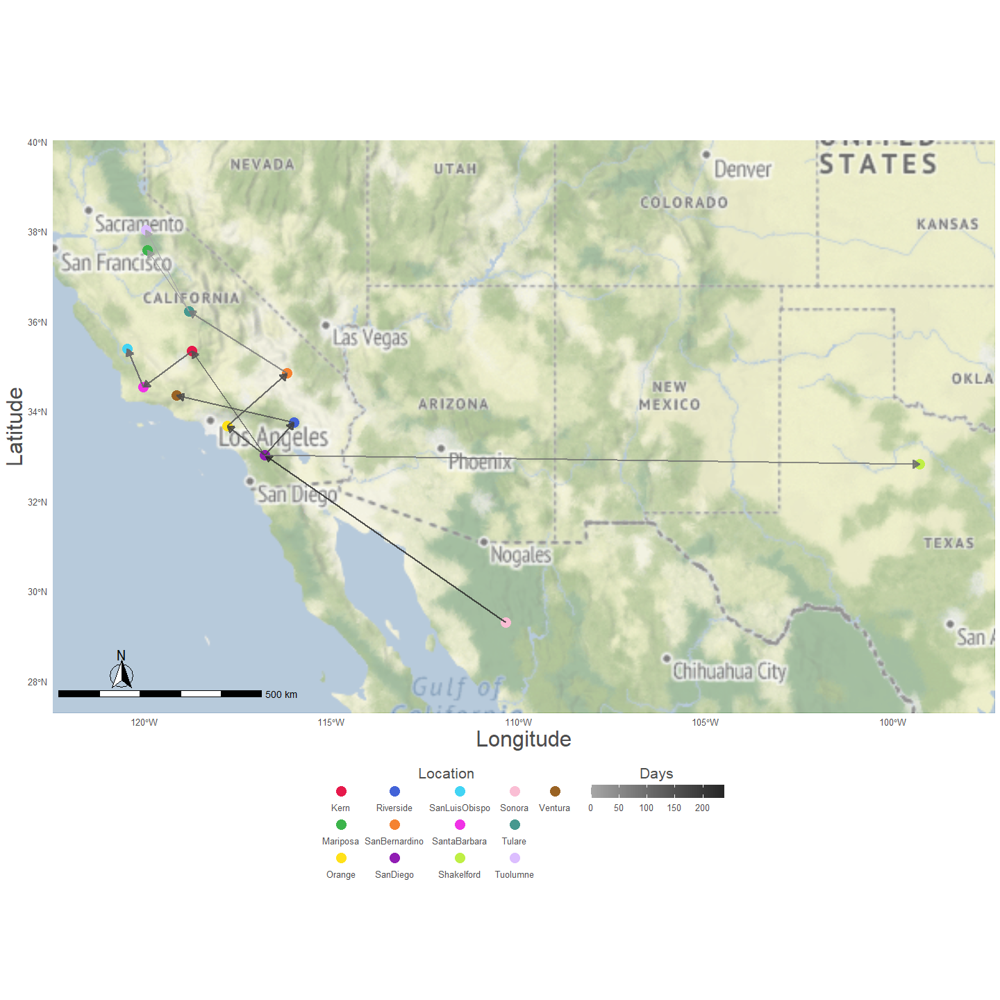
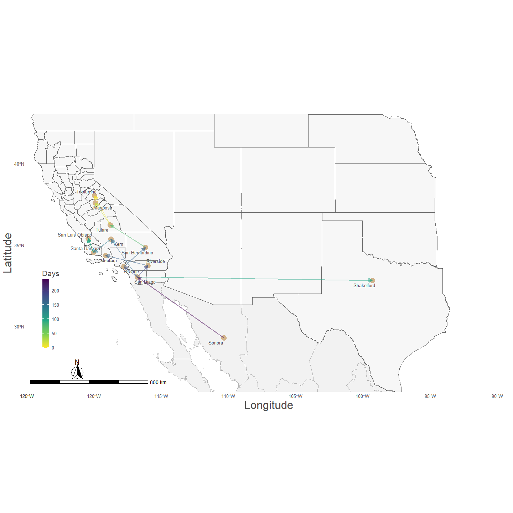
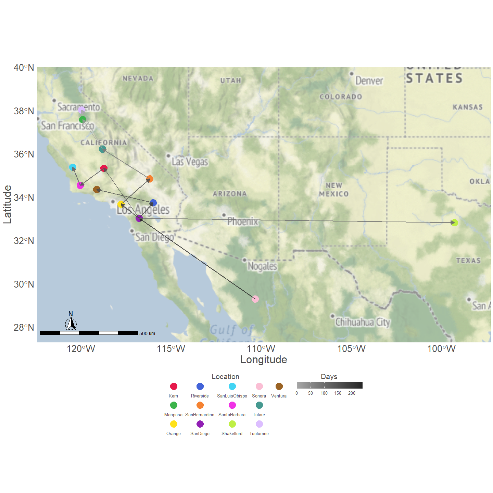
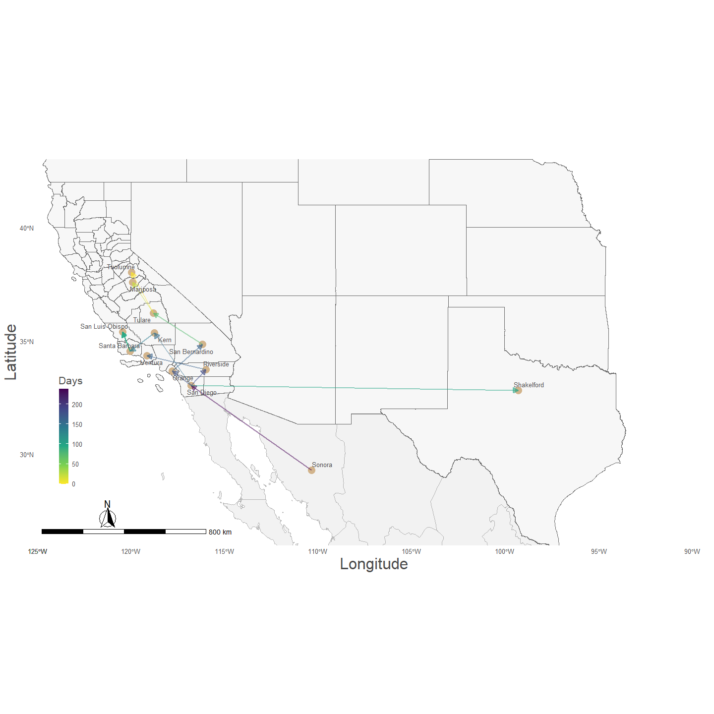
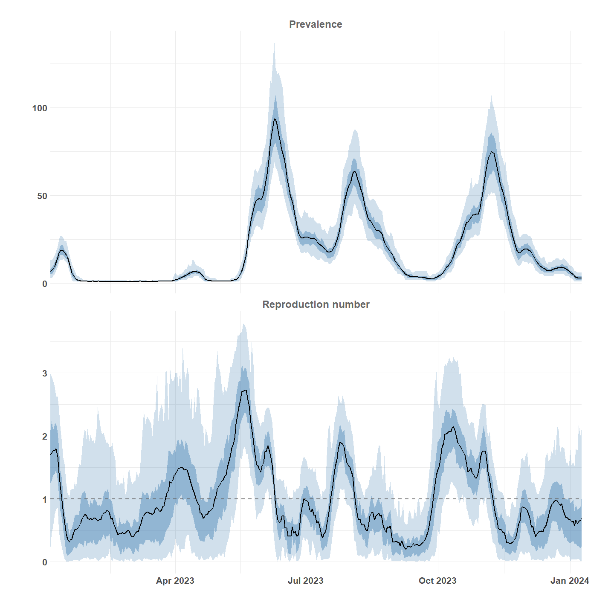

VSV 2023 California Outbreak
================
1/10/26

- <a href="#preliminaries" id="toc-preliminaries">Preliminaries</a>
- <a href="#geographic-boundaries"
  id="toc-geographic-boundaries">Geographic Boundaries</a>
- <a href="#vsv-data" id="toc-vsv-data">VSV Data</a>
- <a href="#substitution-model" id="toc-substitution-model">Substitution
  Model</a>
- <a href="#maximum-likelihood-tree"
  id="toc-maximum-likelihood-tree">Maximum Likelihood Tree</a>
- <a href="#bootstrap" id="toc-bootstrap">Bootstrap</a>
- <a href="#time-calibrated-tree" id="toc-time-calibrated-tree">Time
  Calibrated Tree</a>
- <a href="#beauti-file" id="toc-beauti-file">Beauti File</a>
- <a href="#geographic-signal" id="toc-geographic-signal">Geographic
  Signal</a>
- <a href="#phylodynamics-ne" id="toc-phylodynamics-ne">Phylodynamics
  (Ne)</a>
- <a href="#phylogeography" id="toc-phylogeography">Phylogeography</a>
- <a href="#estimate-prevalence" id="toc-estimate-prevalence">Estimate
  Prevalence</a>
- <a href="#vsv-simulation" id="toc-vsv-simulation">VSV Simulation</a>

## Preliminaries

### Libraries

<details open>
<summary>Hide code</summary>

``` r
library(here) # directory managment
library(tidyverse) # data wrangling
library(scales) # supports ggplot2

# OSF
library(osfr) # data management and archiving

#spatial
library(ggmap) # mapping
library(ggspatial) # mapping
library(sf) # spatial data manipulation
library(tigris) # geographic data
library(terra) # spatial data manipulation
library(rnaturalearth) # global geographic data
library(rnaturalearthhires) # global geographic data
library(rnaturalearthdata) # global geographic data

# Phylogenetic tools
library(ape) #Analyses of Phylogenetics and Evolution (APE)
library(phangorn) # phylogenetic trees and networks
library(treeio) # manipulate trees
library(Biostrings) # sequence wrangling
library(msa) # Multiple Sequence Alignment (MSA) algorithms  
library(ggtree) # tree visualization and annotation
library(EpiSky) # prevalence and Re estimation
```

</details>

### Custom Functions

Loading custom functions form the **R** directory.

<details open>
<summary>Hide code</summary>

``` r
source(here("R/utilities.R"))
source_dir(here("R"))
```

</details>

### Register API

Register Stadia Maps API. Background images for figures provided by
Stadia.

<details open>
<summary>Hide code</summary>

``` r
personal_api <- yaml::read_yaml(here("local", "secrets.yaml"))
register_stadiamaps(key = personal_api$stadi_api)
```

</details>

### OSF Link

Data and outputs generated from this script are stored at the *Open
Science Framework (OSF)* and remotely accessed through code here. See,
this [**OSF Project:**](https://osf.io/vpr2e/) for direct access.

No registration at **OSF** is required to reproduce the analysis, simply
remove or skip the *osf_auth(.)* code in the below chunk.

<details open>
<summary>Hide code</summary>

``` r
osf_auth(personal_api$osf_token) # for write/admin privileges
```

</details>

Record path to **OSF**

<details open>
<summary>Hide code</summary>

``` r
osf_project_data <- osf_retrieve_node("https://osf.io/vpr2e/")

osf_project_data$name # OSF directory for this analysis
```

</details>

    [1] "VSV-Epidemic-2023"

## Geographic Boundaries

### California Counties

Reading and cleaning up jurisdictional geographic boundaries for
analysis.

<details open>
<summary>Hide code</summary>

``` r
options(tigris_use_cache = TRUE)
ca_counties <- counties(state = "CA", year = 2022, class = "sf")
```

</details>

### Get Centroids

Obtain geographic coordinates for county centers

<details open>
<summary>Hide code</summary>

``` r
ca_centroids_sf <- st_centroid(ca_counties)
```

</details>

    Warning: st_centroid assumes attributes are constant over geometries

<details open>
<summary>Hide code</summary>

``` r
# convert to SpatVector format
ca_centroids_sv <- vect(ca_centroids_sf)

coord_frame <- as.data.frame(ca_centroids_sv, geom="xy") %>%
  mutate(county = NAME) %>%
  select(county, x, y)
```

</details>

## VSV Data

### Unsequenced Detections

Case reports provided by USDA Animal and Plant Health Inspection
Service, see [APHIS VSV
Webpage](https://www.aphis.usda.gov/livestock-poultry-disease/cattle/vesicular-stomatitis).

The *vsv_county_noPII.csv* file is shown here for completeness and
internal documentation purposes, however it contains additional data
that is not analysed or presented in the publication. The cleaned
`comb_cases` data is available, all that is used in this analysis, and
is downlaoded from **OSF** in the next chunk.

<details open>
<summary>Hide code</summary>

``` r
vsv_cases <- read_csv(here("local/vsv_county_noPII.csv")) %>%
  filter(ONSET_YEAR >= 2023 & ONSET_YEAR <= 2024) %>%
  mutate(date = paste0(ONSET_YEAR, "-", ONSET_MONTH, "-", ONSET_DAY),
         date = as_date(date, format = "%Y-%m-%d"))

us_cases <- vsv_cases %>%
  filter(COUNTRY == "USA") 

mex_states <- c("SON", "CHH", "CHI") # northern states

mx_cases <- vsv_cases %>%
  filter(COUNTRY == "MEX",
         STATE %in% mex_states)

comb_cases <- rbind(us_cases, mx_cases) %>%
  group_by(COUNTRY, date) %>%
  summarise(inc = length(date))

# save local copy
write.csv(comb_cases, here("local/osf_data/comb_cases.csv"), row.names=FALSE)

# push copy to OSF
osf_upload(osf_project_data, path = here("local/osf_data/comb_cases.csv"))
```

</details>

### Download Case Date

Downloading from OSF and reading into the current session.

<details open>
<summary>Hide code</summary>

``` r
osf_id <- osf_project_data %>% # OSF project
  osf_ls_files() %>% # items in OSF project
  filter(name == "comb_cases.csv") # file to retrieve

osf_download(osf_id,
             path = here("local/run_data"), # local destination
             conflicts = "overwrite")
```

</details>

    # A tibble: 1 × 4
      name           id                       local_path                meta        
      <chr>          <chr>                    <chr>                     <list>      
    1 comb_cases.csv 69630809c9dbdf0f77844959 local/run_data/comb_case… <named list>

<details open>
<summary>Hide code</summary>

``` r
# read file to active environment
comb_cases <- read_csv(here("local/run_data/comb_cases.csv"))
```

</details>

### Check Case Data

<details open>
<summary>Hide code</summary>

``` r
mex_seq_sample <- as_date("2023-01-15") # date of Sonora, Mx sequence
epi_start <- min(comb_cases$date) # inclusive of MX sequence, 2023-01-15
epi_end <- max(comb_cases$date)

epi_phy_lag <- as.integer(mex_seq_sample - epi_start)
epi_phy_lag # days offset between case reports and genomic sample collection
```

</details>

    [1] 11

### Case Data

Mexico detections are for Sonora and Chihuahua, Mexico only.

<details open>
<summary>Hide code</summary>

``` r
inc_plot <- comb_cases %>%
  mutate(
    epiweek_start = floor_date(date, unit = "week", week_start = 1)
  ) %>%
  group_by(COUNTRY, epiweek_start) %>%
  summarise(inc = sum(inc, na.rm = TRUE), .groups = "drop")

ggplot(inc_plot, aes(x = epiweek_start, y = inc, fill = COUNTRY)) +
  geom_bar(stat="identity") +
  scale_fill_manual(
    values = c(
      "USA" = "steelblue",
      "MEX" = "darkorange"
    )
  ) +
  scale_x_date(expand = c(0, 0)) +
  labs(
    fill = "Country",
    x = " ",
    y = "Incidence",
    title = " "
  ) +
  theme_minimal() +
  theme(
    plot.margin = unit(c(0.5, 0.5, 0.5, 0.5), "cm"),
    legend.position = "bottom",
    legend.text = element_text(size = 14, face = "bold"),
    legend.title = element_text(size = 16, face = "bold"),
    axis.title.x = element_text(size = 20, face = "bold", vjust = -2),
    axis.title.y = element_text(size = 20, face = "bold", vjust = 3),
    axis.text.x = element_text(size = 18, face = "bold"),
    axis.text.y = element_text(size = 18, face = "bold"),
    plot.title = element_text(size = 22, face = "bold", colour="gray50", hjust = 0.5)
  )
```

</details>



### Genomic Metadata

Metadata associated with genomic sequences

<details open>
<summary>Hide code</summary>

``` r
vsv_meta <- readxl::read_excel(here("local/Filesnames 1.xlsx"), .name_repair="universal")
```

</details>

    New names:
    • `New Label` -> `New.Label`

<details open>
<summary>Hide code</summary>

``` r
names(vsv_meta) <- c("fastq", "meta", "tip", "horse", "date", "county")

vsv_meta <- vsv_meta %>%
  mutate(date = as_date(date),
         tip = gsub("-", "_", tip)) %>%
  select(tip, date, county)

head(vsv_meta)
```

</details>

    # A tibble: 6 × 3
      tip              date       county   
      <chr>            <date>     <chr>    
    1 San_Diego_5_14_1 2023-05-14 San Diego
    2 San_Diego_5_14b  2023-05-14 San Diego
    3 San_Diego_5_15a  2023-05-15 San Diego
    4 San_Diego_5_20   2023-05-20 San Diego
    5 San_Diego_5_22a  2023-05-22 San Diego
    6 San_Diego_5_23   2023-05-23 San Diego

<details open>
<summary>Hide code</summary>

``` r
#get labels
keep_labels <- c(vsv_meta$tip, "Mexico2023") # also keep MX sample

length(keep_labels)
```

</details>

    [1] 36

### Load and Filter Alignment

Read alignment

<details open>
<summary>Hide code</summary>

``` r
alignment <- read.dna(here("local/world.fasta"),
                      format="fasta")

# label alignment
matched_labels <- keep_labels[keep_labels %in% rownames(alignment)]
selected_seqs <- alignment[matched_labels, , drop = FALSE]
```

</details>
<details open>
<summary>Hide code</summary>

``` r
# save copy of alignment
write.nexus.data(as.character(selected_seqs), 
                 file = here("local/vsv_2023.nex"), 
                 format = "dna")

# push copy to OSF
osf_upload(osf_project_data, path = here("local/vsv_2023.nex"))
```

</details>

### Organize Data

A couple of mispelled county names in the data

<details open>
<summary>Hide code</summary>

``` r
# correct county names
vsv_meta <- vsv_meta %>%
  mutate(
    county = case_when(
      county == "San Bernadino" ~ "San Bernardino",
      county == "San Luis" ~ "San Luis Obispo",
      tip == "Tulare_10_2" ~ "Tulare",
      TRUE ~ county
    ),
    date = if_else(is.na(date) & tip == "Santa_Barbara", as.Date("2023-07-20"), date)
  )

vsv_meta <- left_join(vsv_meta, coord_frame, by = "county")

# Texas data
vsv_meta <- vsv_meta %>%
  mutate(x = if_else(county == "Shakelford", -99.2786, x),
         y = if_else(county == "Shakelford", 32.8242, y))

mex_meta <- as.data.frame( 
  cbind(
  tip = "Mexico2023",
  date = "2023-01-15",
  county = "Sonora",
  x = -110.3309, # center of Sonora
  y = 29.2972
  )
)

mex_meta$date <- as_date(mex_meta$date)

vsv_meta <- rbind(mex_meta, vsv_meta)

vsv_meta <- vsv_meta %>%
  mutate(x = as.numeric(x),
         y = as.numeric(y))
```

</details>

## Substitution Model

Compare models of evolution

<details open>
<summary>Hide code</summary>

``` r
aligned_phyDat <- as.phyDat(selected_seqs)
  
# run the test, compare the models
mt <- modelTest(aligned_phyDat)
```

</details>

    Model        df  logLik   AIC      BIC
              JC 69 -16584.73 33307.46 33812.33 
            JC+I 70 -16580.16 33300.32 33812.5 
         JC+G(4) 70 -16580.85 33301.69 33813.87 
       JC+G(4)+I 71 -16579.97 33301.94 33821.44 
             F81 72 -16322.21 32788.41 33315.23 
           F81+I 73 -16317.59 32781.18 33315.31 
        F81+G(4) 73 -16318.3 32782.6 33316.73 
      F81+G(4)+I 74 -16317.4 32782.8 33324.25 
             K80 70 -16532.76 33205.51 33717.69 
           K80+I 71 -16528.19 33198.38 33717.88 
        K80+G(4) 71 -16528.87 33199.75 33719.24 
      K80+G(4)+I 72 -16528 33200.01 33726.82 
             HKY 73 -16268.54 32683.08 33217.21 
           HKY+I 74 -16263.9 32675.8 33217.25 
        HKY+G(4) 74 -16264.62 32677.24 33218.69 
      HKY+G(4)+I 75 -16263.71 32677.42 33226.18 
            TrNe 71 -16532.53 33207.07 33726.56 
          TrNe+I 72 -16528 33200 33726.82 
       TrNe+G(4) 72 -16528.67 33201.33 33728.15 
     TrNe+G(4)+I 73 -16527.81 33201.63 33735.76 
             TrN 74 -16268.54 32685.07 33226.52 
           TrN+I 75 -16263.9 32677.8 33226.57 
        TrN+G(4) 75 -16264.62 32679.24 33228.01 
      TrN+G(4)+I 76 -16263.71 32679.42 33235.5 
            TPM1 71 -16531.67 33205.35 33724.84 
          TPM1+I 72 -16527.1 33198.21 33725.02 
       TPM1+G(4) 72 -16527.79 33199.58 33726.39 
     TPM1+G(4)+I 73 -16526.92 33199.83 33733.96 
             K81 71 -16531.67 33205.35 33724.84 
           K81+I 72 -16527.1 33198.21 33725.02 
        K81+G(4) 72 -16527.79 33199.58 33726.39 
      K81+G(4)+I 73 -16526.92 33199.83 33733.96 
           TPM1u 74 -16267.16 32682.31 33223.76 
         TPM1u+I 75 -16262.51 32675.02 33223.79 
      TPM1u+G(4) 75 -16263.24 32676.47 33225.24 
    TPM1u+G(4)+I 76 -16262.32 32676.64 33232.72 
            TPM2 71 -16529.05 33200.09 33719.59 
          TPM2+I 72 -16524.54 33193.08 33719.9 
       TPM2+G(4) 72 -16525.19 33194.38 33721.2 
     TPM2+G(4)+I 73 -16524.36 33194.71 33728.84 
           TPM2u 74 -16265.99 32679.98 33221.43 
         TPM2u+I 75 -16261.45 32672.91 33221.67 
      TPM2u+G(4) 75 -16262.12 32674.24 33223 
    TPM2u+G(4)+I 76 -16261.26 32674.53 33230.61 
            TPM3 71 -16532.74 33207.47 33726.97 
          TPM3+I 72 -16528.18 33200.36 33727.17 
       TPM3+G(4) 72 -16528.86 33201.71 33728.53 
     TPM3+G(4)+I 73 -16527.99 33201.98 33736.11 
           TPM3u 74 -16268.31 32684.62 33226.07 
         TPM3u+I 75 -16263.69 32677.37 33226.14 
      TPM3u+G(4) 75 -16264.4 32678.8 33227.57 
    TPM3u+G(4)+I 76 -16263.49 32678.99 33235.07 
           TIM1e 72 -16531.45 33206.9 33733.71 
         TIM1e+I 73 -16526.92 33199.83 33733.96 
      TIM1e+G(4) 73 -16527.58 33201.16 33735.3 
    TIM1e+G(4)+I 74 -16526.73 33201.46 33742.9 
            TIM1 75 -16267.16 32684.31 33233.08 
          TIM1+I 76 -16262.51 32677.02 33233.1 
       TIM1+G(4) 76 -16263.24 32678.47 33234.55 
     TIM1+G(4)+I 77 -16262.32 32678.64 33242.03 
           TIM2e 72 -16528.83 33201.65 33728.46 
         TIM2e+I 73 -16524.35 33194.7 33728.83 
      TIM2e+G(4) 73 -16524.98 33195.97 33730.1 
    TIM2e+G(4)+I 74 -16524.16 33196.32 33737.77 
            TIM2 75 -16265.99 32681.98 33230.74 
          TIM2+I 76 -16261.45 32674.91 33230.99 
       TIM2+G(4) 76 -16262.12 32676.24 33232.32 
     TIM2+G(4)+I 77 -16261.26 32676.53 33239.93 
           TIM3e 72 -16532.51 33209.03 33735.84 
         TIM3e+I 73 -16527.99 33201.98 33736.11 
      TIM3e+G(4) 73 -16528.65 33203.3 33737.43 
    TIM3e+G(4)+I 74 -16527.8 33203.6 33745.05 
            TIM3 75 -16268.31 32686.62 33235.38 
          TIM3+I 76 -16263.69 32679.37 33235.45 
       TIM3+G(4) 76 -16264.4 32680.8 33236.88 
     TIM3+G(4)+I 77 -16263.49 32680.99 33244.39 
            TVMe 73 -16526.12 33198.24 33732.37 
          TVMe+I 74 -16521.62 33191.24 33732.69 
       TVMe+G(4) 74 -16522.27 33192.54 33733.99 
     TVMe+G(4)+I 75 -16521.44 33192.87 33741.63 
             TVM 76 -16262.77 32677.55 33233.63 
           TVM+I 77 -16258.26 32670.51 33233.91 
        TVM+G(4) 77 -16258.91 32671.83 33235.22 
      TVM+G(4)+I 78 -16258.07 32672.13 33242.85 
             SYM 74 -16525.9 33199.8 33741.25 
           SYM+I 75 -16521.43 33192.86 33741.62 
        SYM+G(4) 75 -16522.06 33194.12 33742.88 
      SYM+G(4)+I 76 -16521.24 33194.48 33750.56 
             GTR 77 -16262.77 32679.55 33242.95 
           GTR+I 78 -16258.26 32672.51 33243.23 
        GTR+G(4) 78 -16258.91 32673.83 33244.54 
      GTR+G(4)+I 79 -16258.07 32674.13 33252.16 

<details open>
<summary>Hide code</summary>

``` r
mt %>% # no important differences
  arrange(AIC) %>%
  slice_head(n=5) 
```

</details>

           Model df    logLik      AIC       AICw     AICc      AICcw      BIC
    1      TVM+I 77 -16258.26 32670.51 0.24357220 32671.60 0.24275008 33233.91
    2   TVM+G(4) 77 -16258.91 32671.83 0.12632700 32672.91 0.12590062 33235.22
    3 TVM+G(4)+I 78 -16258.07 32672.13 0.10835930 32673.25 0.10647373 33242.85
    4      GTR+I 78 -16258.26 32672.51 0.08961968 32673.63 0.08806020 33243.23
    5    TPM2u+I 75 -16261.45 32672.91 0.07355473 32673.94 0.07537266 33221.67

<details open>
<summary>Hide code</summary>

``` r
# select model
env <- attr(mt, "env")
best_mod <- eval(get("GTR+I", env), env) 
```

</details>

## Maximum Likelihood Tree

Constructing a quick max likelihood tree to check initial results before
inferring time calibrated tree.

<details open>
<summary>Hide code</summary>

``` r
fit1 <- optim.pml(best_mod, # best model 
                 optNni = FALSE, optBf = TRUE, 
                 optQ = TRUE, optInv = TRUE, 
                 optGamma = FALSE, optEdge = FALSE, 
                 optRate = TRUE, 
                 control = pml.control(epsilon = 1e-08,
                                       maxit = 200, trace = 0))

#Fix substitution model and fit tree
fit2 <- optim.pml(fit1, 
                 optNni = TRUE, optBf = FALSE,
                 optQ = FALSE, optInv = FALSE, 
                 optGamma = FALSE, optEdge = TRUE,
                 control = pml.control(epsilon = 1e-08, 
                                       maxit = 200, trace = 0))

#Fine tune
fit3 <- optim.pml(fit2, 
                 optNni = TRUE, optBf = TRUE,
                 optQ = TRUE, optInv = TRUE, 
                 optGamma = FALSE, optEdge = TRUE, 
                 optRate = FALSE,
                 control = pml.control(epsilon = 1e-08, 
                                       maxit = 200, trace = 0))
```

</details>

## Bootstrap

Bootstrap support values

<details open>
<summary>Hide code</summary>

``` r
set.seed(1976)
boots <- bootstrap.pml(fit3,
                       bs = 500, # reduced count for rendering
                       optNni = TRUE,
                       control = pml.control(trace = 0))

saveRDS(boots, here("local/ml_boots_2025-12-15.rds"))
```

</details>

### View ML Tree

Node values suggest high uncertainty, likely do to high-relatedness.

<details open>
<summary>Hide code</summary>

``` r
boots <- readRDS(here("local/ml_boots_2025-12-15.rds"))

ml_tree <- fit3$tree

bs_tree <- plotBS(midpoint(ml_tree), boots, 
       type="p", cex=0.4,
       bs.adj = c(1.25, 1.25),
       bs.col = "black")
```

</details>



<details open>
<summary>Hide code</summary>

``` r
plotBS(bs_tree)
add.scale.bar()
title("Maximum Likelihood")
```

</details>



## Time Calibrated Tree

### Temporal Signal

Determine if time correlation is present in the sequences (yes)

<details open>
<summary>Hide code</summary>

``` r
check_tree <- midpoint(ml_tree)
rtips <- adephylo::distRoot(check_tree)

vsv_meta$date_dec <- decimal_date(vsv_meta$date)

date_vector <- setNames(vsv_meta$date_dec, vsv_meta$tip)
date_vector <- date_vector[check_tree$tip.label]


plot(date_vector, rtips, xlab = "Sampling date", ylab = "Root-to-tip distance")
abline(lm(rtips ~ date_vector), col = "red")
```

</details>



<details open>
<summary>Hide code</summary>

``` r
summary(lm(rtips ~ date_vector))
```

</details>


    Call:
    lm(formula = rtips ~ date_vector)

    Residuals:
           Min         1Q     Median         3Q        Max 
    -3.405e-04 -1.275e-04 -5.320e-06  7.585e-05  5.152e-04 

    Coefficients:
                  Estimate Std. Error t value Pr(>|t|)    
    (Intercept) -1.9419006  0.4224872  -4.596 5.70e-05 ***
    date_vector  0.0009600  0.0002088   4.598 5.67e-05 ***
    ---
    Signif. codes:  0 '***' 0.001 '**' 0.01 '*' 0.05 '.' 0.1 ' ' 1

    Residual standard error: 0.0001914 on 34 degrees of freedom
    Multiple R-squared:  0.3834,    Adjusted R-squared:  0.3653 
    F-statistic: 21.14 on 1 and 34 DF,  p-value: 5.67e-05

Save dates file for BEAST

<details open>
<summary>Hide code</summary>

``` r
dates_file <- vsv_meta %>%
  select(tip, date_dec)

write.table(dates_file,
            file = here("local/vsv_dates.txt"),
            sep = "\t",
            row.names = FALSE,
            col.names = TRUE,
            quote = FALSE)
```

</details>

## Beauti File

Push copy of Beauti input file needed for
[BEAST](https://github.com/CompEvol/beast2) to OSF

<details open>
<summary>Hide code</summary>

``` r
osf_upload(osf_project_data, path = here("local/run_2025-12-18/beauti_info.xml"))
```

</details>

### Tracer Stats

Tree run in BEAST

<details open>
<summary>Hide code</summary>

``` r
tracer_stats <- get_tracer_stats(here("local/run_2025-12-18/vsv_2023_geog.log"),
                                 use_burnin=0.10)

stats_to_return <- c("posterior", "likelihood", "prior", "treeLikelihood", 
                     "Tree.height", "Tree.treeLength", "lockRate.vsv_2023",
                     "popSize", "CoalescentConstant")

tracer_stats %>%
  filter(Parameter %in% stats_to_return)
```

</details>

               Parameter       Mean     Median    Q_0.025    Q_0.975   ESS
    1          posterior -16693.450 -16695.838 -16737.189 -16633.516   334
    2         likelihood -16618.111 -16617.835 -16629.471 -16608.199 11480
    3              prior    -75.339    -77.756   -117.747    -16.025   349
    4     treeLikelihood -16566.649 -16566.344 -16576.081 -16559.054 13893
    5        Tree.height      0.885      0.873      0.817      1.019 17939
    6    Tree.treeLength      3.942      3.883      3.226      4.987  7310
    7            popSize      0.415      0.400      0.251      0.669 12178
    8 CoalescentConstant     -3.104     -2.790    -16.540      8.627  7726

### View Time Tree

Download trees

<details open>
<summary>Hide code</summary>

``` r
osf_project_data %>%
  osf_ls_files() %>%
  filter(grepl("\\.tree$", name)) %>%
  osf_download(
    path = here("local/run_2025-12-18"),
    conflicts = "overwrite"
  )
```

</details>

    # A tibble: 2 × 4
      name              id                       local_path             meta        
      <chr>             <chr>                    <chr>                  <list>      
    1 location_mcc.tree 6970069f188b6a06f61b0382 local/run_2025-12-18/… <named list>
    2 mcc.tree          6970070e9377eadcb8b50d1c local/run_2025-12-18/… <named list>

<details open>
<summary>Hide code</summary>

``` r
mcc_tree <- read.beast(here("local/run_2025-12-18/mcc.tree"))
tree_data <- as_tibble(mcc_tree)

p <- ggtree(mcc_tree, aes(color = posterior), mrsd="2023-11-08") +
  theme_tree2() +
  geom_tiplab(size = 3) +
  geom_text2(
    aes(label = ifelse(!isTip & !is.na(posterior), sprintf("%.2f", posterior), "")),
    hjust = -0.2, size = 2.8, color = "black"
  ) +
  scale_color_gradient(low = "gray60", high = "red") +
  labs(title = "VSV 2023 (MCC Tree)", color = "Posterior\nsupport") +
  theme(
    plot.margin = unit(c(0.5, 0.25, 0.5, 0.25), "cm"),
    legend.key.width = unit(1, "line"),
    legend.key.height = unit(2, "line"),
    legend.title = element_text(size = 16, face = "bold"),
    legend.text = element_text(size = 14, face = "bold"),
    legend.position.inside = TRUE,
    legend.position = c(0.2, 0.7),
    plot.title = element_text(hjust = 0.5, face = "bold", size = 14),
    axis.title.x = element_text(size = 16, face = "bold")
  ) +
  scale_x_continuous(
    name = "  ",
    expand = c(0.01, 0)
  )

p
```

</details>



<details open>
<summary>Hide code</summary>

``` r
# ggsave(here("images/vsv_tree.pdf"), p, width = 16, height = 10, units = "in")
```

</details>

### GeoCoded Tree

<details open>
<summary>Hide code</summary>

``` r
tree_loc <- read.beast(here("local/run_2025-12-18/location_mcc.tree"))

tip_meta <- as_tibble(tree_loc) %>% 
  select(label, location) %>%
  distinct()

loc_levels <- sort(unique(tip_meta$location))
loc_cols <- setNames(
  pals::trubetskoy(length(loc_levels)),
  loc_levels
)

loc_label_map <- c(
  SanBernardino  = "San Bernardino",
  SanDiego       = "San Diego",
  SanLuisObispo  = "San Luis Obispo",
  SantaBarbara   = "Santa Barbara"
)

tree_p <- ggtree(mcc_tree, mrsd = "2023-11-08") %<+% tip_meta +
  theme_tree2() +
  ggnewscale::new_scale_color() +
  geom_tippoint(
    aes(color = location),
    size = 6,
    alpha = 0.9
  ) +
  scale_color_manual(
  values = loc_cols,
  name   = "Location",
  labels = function(x) ifelse(x %in% names(loc_label_map),
                              loc_label_map[x],
                              x)
  ) +
  geom_tiplab(size = 3, hjust = -0.09) +
  labs(title = " ") +
  theme(
    plot.margin = unit(c(0.15, 0.15, 0.15, 1.15), "cm"),
    legend.key.width = unit(1, "line"),
    legend.key.height = unit(2, "line"),
    legend.title = element_text(size = 18, face = "bold"),
    legend.text = element_text(size = 16, face = "bold"),
    legend.position.inside = TRUE,
    legend.position = c(0.08, 0.65),
    plot.title = element_text(hjust = 0.5, face = "bold", size = 14),
    axis.title.x = element_text(size = 16, face = "bold"),
    axis.text.x = element_text(size = 25, face = "bold")
  ) +
  scale_x_continuous(
    name = "  ",
    expand = c(0.01, 0)
  )

tree_p <- tree_p + hexpand(0.2, direction = 1)

tree_p
```

</details>


<details open>
<summary>Hide code</summary>

``` r
# ggsave(here("images/vsv_tree.pdf"), p, width = 16, height = 10, units = "in")
```

</details>

## Geographic Signal

Test for significance of time in the phylogeny

<details open>
<summary>Hide code</summary>

``` r
# calculate genetic distances
gen_dist <- dist.dna(selected_seqs, model = "raw")

# geographic distances
geo_dist <- geosphere::distm(
  as.matrix(
    vsv_meta[, c("x", "y")]
    )
  )

# matrix names
rownames(geo_dist) <- vsv_meta$tip
colnames(geo_dist) <- vsv_meta$tip

# order
tips_order <- vsv_meta$tip
gen_dist <- as.matrix(gen_dist)[tips_order, tips_order]
geo_dist <- geo_dist[tips_order, tips_order]
```

</details>

### Mantel Test

Strong geographic signal

<details open>
<summary>Hide code</summary>

``` r
mantel_result <- vegan::mantel(as.dist(gen_dist), 
                               as.dist(geo_dist), 
                               method = "pearson", 
                               permutations = 9999)
mantel_result
```

</details>


    Mantel statistic based on Pearson's product-moment correlation 

    Call:
    vegan::mantel(xdis = as.dist(gen_dist), ydis = as.dist(geo_dist),      method = "pearson", permutations = 9999) 

    Mantel statistic r: 0.7018 
          Significance: 1e-04 

    Upper quantiles of permutations (null model):
      90%   95% 97.5%   99% 
    0.168 0.234 0.426 0.511 
    Permutation: free
    Number of permutations: 9999

Save locations file for BEAST

<details open>
<summary>Hide code</summary>

``` r
locs_file <- vsv_meta %>%
  select(tip, county)

write.table(locs_file,
            file = here("local/vsv_locs.txt"),
            sep = "\t",
            row.names = FALSE,
            col.names = TRUE,
            quote = FALSE)
```

</details>

## Phylodynamics (Ne)

Estimating effective population size

<details open>
<summary>Hide code</summary>

``` r
phy <- as.phylo(mcc_tree)

phylodynamic_process(tree=phy,
                     mrsd = as.Date("2023-11-08"),
                     x_min = as.Date("2023-01-01"),
                     x_max = as.Date("2023-11-20")
                     )
```

</details>



## Phylogeography

### Transitions Network

Version with background

<details open>
<summary>Hide code</summary>

``` r
plot_migration_network_terra(tree_loc,
                             vsv_meta,
                             ca_counties,
                             epi_start,
                             epi_end,
                             loc_cols)
```

</details>



version with simple background

<details open>
<summary>Hide code</summary>

``` r
plot_migration_network(tree_loc,
                       vsv_meta,
                       ca_counties,
                       epi_start,
                       epi_end)
```

</details>



## Estimate Prevalence

Approximate prevalaence from case detections assuming an infectious
period as described by [Humphreys, et. al
2024](https://www.mdpi.com/1999-4915/16/8/1315).

Credible interval from above paper implied vertebrate hosts remained
infectious for 7.69–11.11 days post-infection.

<details open>
<summary>Hide code</summary>

``` r
CI_0.025_infect_period <- 7.69
CI_0.975_infect_period <- 11.11

# death rate
D_days <- (CI_0.025_infect_period+CI_0.975_infect_period)/2 # average
D_weeks <- D_days/7

df_prev <- comb_cases %>% 
  as.data.frame() %>%
  dplyr::select(-COUNTRY) %>%
  arrange(date)

# daily incidence
df_full <- df_prev %>%
  complete(date = seq(min(date), max(date), by = "day")) %>%
  mutate(inc = replace_na(inc, 0))

# infectiousness kernel
# kernel <- c(0.5, 0.5, 0) # weekly
kernel <- rep(1/2, D_days) # daily

N_pop <- 4e5 # approx horses in CA

df_full <- df_full %>%
  mutate(
    I_est = zoo::rollapply(
      inc,
      width = length(kernel),
      FUN = function(x) {
        k <- rev(kernel)[seq_along(x)]
        sum(k * x)
      },
      align = "right",
      fill = NA_real_,
      partial = TRUE
    ),
    prev_pop = I_est / N_pop# decimal rates for horse pop
  )

# whole count version
train_mod <- df_full %>%
  arrange(date) %>%
  mutate(time = as.integer(date - min(date)),
         prev = ceiling(if_else(is.na(I_est), 1, I_est))
  ) %>%
  select(time, prev)
```

</details>

### Scale Phylogeny

From units years to units days

<details open>
<summary>Hide code</summary>

``` r
phy$edge.length <- phy$edge.length * 365.25 # to units days
```

</details>

### Outbreak Duration

<details open>
<summary>Hide code</summary>

``` r
outbreak_dur <- max(comb_cases$date) - min(comb_cases$date) + 1
outbreak_dur
```

</details>

    Time difference of 371 days

<details open>
<summary>Hide code</summary>

``` r
stop_time <- as.numeric(outbreak_dur) # units of days

# extract and align genomic and case data
align_genetic_data <- genetic_data(phy, stop_time, ptree_lag = epi_phy_lag)
align_genetic_data$n_coal[is.na(align_genetic_data$n_coal)] <- 0

death_rate <- 1/D_days # end of infectiousness takes D_days units of time
0.35/death_rate # basic R0
```

</details>

    [1] 3.29

<details open>
<summary>Hide code</summary>

``` r
# Birth rate function - constant 0.3
constant <- function(t) {
  return(0.35)
}
```

</details>

## VSV Simulation

The *pmmh()* function is provided by the [Gill et al
2025](https://academic.oup.com/jrsssc/advance-article/doi/10.1093/jrsssc/qlaf065/8362913)
and the **EpiSky** R-package. The version *pmmh2()* used here has been
modified slightly to address indexing issues and unintentional
conversion of dataframe objects to tibble class.

<details open>
<summary>Hide code</summary>

``` r
set.seed(1976)
vsv_simulation <- pmmh2(
  iter = 10000, # 10000 iterations,
  max_time = 300*60, # model run time (seconds)
  target_acceptance = 0.1, # sample acceptance rate
  sigma0 = 0.1,# initial smoothness parameter
  reporting_prob0 = 0.1, # probability of being detected/reported
  x0 = 3, # initial index infections
  genetic_data= align_genetic_data, # aligned tree and case reports
  death_rate = death_rate, # death rate as estimated above
  ptree = phy, # phylogeny
  ptree_lag = epi_phy_lag, # lag time between genomic and field reports
  sample_prevalence = train_mod, # case samples
  sigma_mean = 0.1, # exponential smoothness
  pobs_prior = "beta", # distribution
  pobs_alpha = 2, # beta param
  pobs_beta = 5, # beta param
  x0_prior = "nbinom", # prevalence distribution, negative binomial
  x0_mean = 5, # nbinom param
  x0_var = 10, # nbinom param
  n_particles = 1000, # particles
  ess_threshold = 500, # Effective Sample Size minimum
  resampling_scheme = "systematic", # resampling strategy
  backward_sim = TRUE # sample simulations
)

# save result
saveRDS(chain, here("local/est_R0/vsv_simulation_2025-12-30.rds"))
```

</details>

### Effective Reproduction and Prevalence

Download and read simulation results

<details open>
<summary>Hide code</summary>

``` r
osf_id <- osf_project_data %>%
  osf_ls_files() %>%
  filter(name == "vsv_simulation_2025-12-30.rds") %>%
  osf_download(osf_id,
               path = here("local/est_R0"),
               conflicts = "overwrite")

vsv_simulation <- readRDS(here("local/est_R0/vsv_simulation_2025-12-30.rds"))
```

</details>
<details open>
<summary>Hide code</summary>

``` r
plot_rt_prev(vsv_simulation, death_rate, 
             epi_start, epi_end,
             burn_in=2000)
```

</details>


